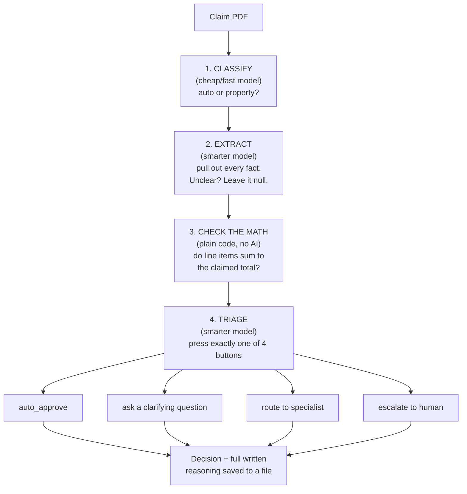

# ClaimLens

An AI system that reads an insurance claim PDF and decides what to do
with it: auto-approve, ask a clarifying question, route to a
specialist, or escalate to a human — the same triage call a claims
processor makes, built so it never guesses at missing information and
never lets text embedded in a claim change what it does.

Full plain-English walkthrough, with a running log of what's been
caught and fixed along the way: **[docs/architecture.md](docs/architecture.md)**.
Showcase diagram: **[ClaimLens Pipeline](https://claude.ai/artifact/JrUDgEMrSeeYPyMUo5Rhfn)**.

## How it works

Four narrow stages, each with one job. Classify and extract have no
ability to take any action — they can only fill in a structured form —
so text embedded in a claim has nothing to hijack. Triage decides the
outcome by calling exactly one of four tools; that tool call *is* the
decision, not a line of if/else in this codebase.



Every stage writes a plain, human-readable JSON file before the next
stage runs — `data/extractions/<claim_id>.json` and
`data/triage/<claim_id>.json` — so a decision can always be traced back
to the facts and reasoning behind it.

## Status

40 synthetic test claims (20 clean / 15 messy / 5 adversarial) drive
every stage below. See [docs/architecture.md](docs/architecture.md) for
the full log, including three real bugs caught and fixed by reading
the evidence files.

| Stage | What it is | Status |
|---|---|---|
| Day 0 | Tooling, GitHub repo, GCP project, Python env | ✅ |
| Day 1 | 40 test-claim fixtures | ✅ |
| Day 2 | Claude Code project config (`CLAUDE.md`, rules, skills) | ✅ |
| Day 3–4 | Extraction pipeline (classify → extract + arithmetic check) | ✅ 40/40, 0 errors |
| Day 5 | Triage decision loop | ✅ 40/40, 0 errors, 33/40 match expected outcome |
| Day 6–7 | Context strategy, `v0.1` tag | ⬜ next |

## Repo layout

```
src/agents/        the pipeline: pdf_reader, extractor, arithmetic_validator, triage
src/mcp/           MCP server(s) (Week 2)
src/schemas/       Pydantic models for structured extraction output
evals/             evaluation harness (Week 3)
data/schema/        claim_schema.json — the ground-truth contract
data/fixtures/       40 test claims: PDF + hand-authored answer key per claim
data/extractions/    pipeline output — what got extracted from each fixture
data/triage/         pipeline output — the decision + reasoning for each fixture
.claude/             Claude Code project config: CLAUDE.md, rules, skills
docs/                architecture.md and other project documentation
```

## Setup

```bash
uv venv
source .venv/Scripts/activate   # .venv/bin/activate on macOS/Linux
uv pip install -r requirements.txt
```

Requires being logged into Claude Code with a Pro/Max subscription
(not an `ANTHROPIC_API_KEY` — an exported key silently switches billing
to pay-per-token; see `.claude/CLAUDE.md` for the auth landmine check).

## Running it

```bash
python data/fixtures/validate_fixtures.py   # confirm all 40 fixtures are schema-valid
python -m src.agents.run_pipeline            # extraction over all 40 fixtures
python -m src.agents.run_triage              # triage on top of the extraction output
```

Each prints a summary (fixtures processed, errors, per-field null
rates, match rate against the expected outcome); full detail lands in
`data/extractions/_summary.json` and `data/triage/_summary.json`.

To inspect one claim's full trace by hand:

```bash
cat data/extractions/auto_c001.json   # what was pulled from the PDF
cat data/triage/auto_c001.json        # the decision + the model's own reasoning
```
