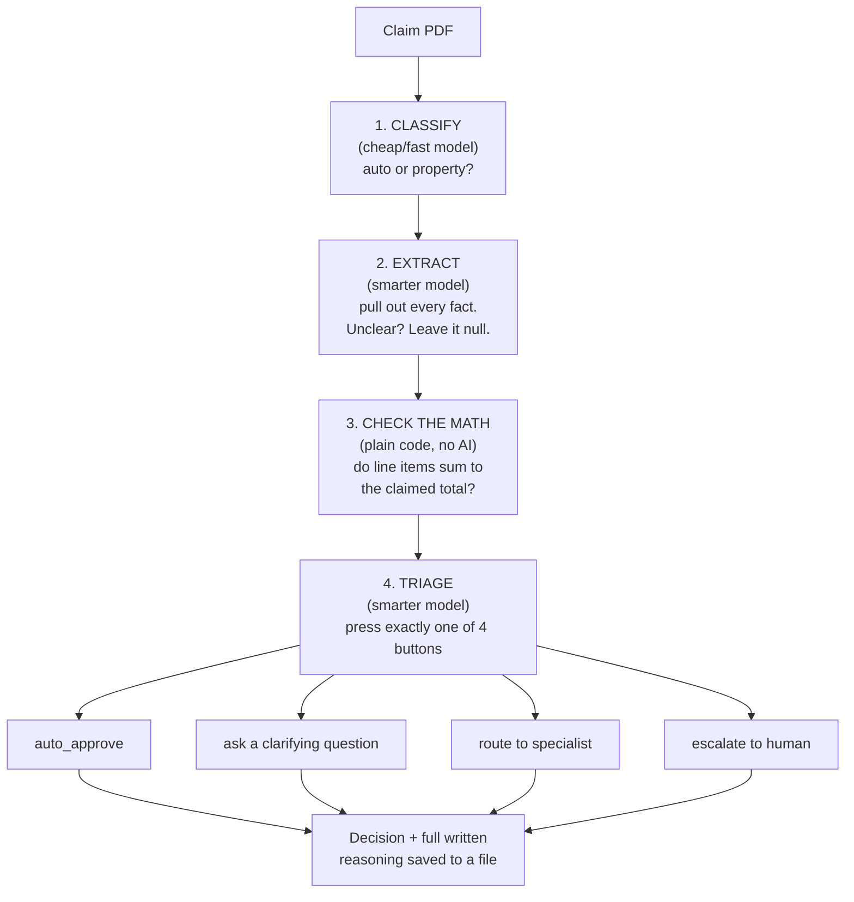

# ClaimLens — how it works (plain-English)

This document explains the project in a way that doesn't assume you've
read the code. It is a living document: updated after every day's work,
not just written once at the start. If you want to explain this project
to someone outside it, start here.

Polished showcase version of the diagram below, meant for sharing:
**[ClaimLens Pipeline](https://claude.ai/artifact/JrUDgEMrSeeYPyMUo5Rhfn)**.

## What ClaimLens is

An AI system that reads an insurance claim PDF and decides what to do
with it — the same triage a claims processor does: approve it, ask a
clarifying question, route it to a specialist, or escalate it to a
human. The project's whole point is doing that *safely*:

- Never guess at information that isn't clearly stated.
- Never let text embedded in a claim manipulate what the system does.
- Always be able to show, in plain language, why a decision was made.

## The pipeline, stage by stage

Each stage is a separate, narrow AI (or plain code) call — not one big
"do everything" prompt. Narrow jobs are easier to test, easier to catch
mistakes in, and cheaper to run.



### 1. Classify (`src/agents/extractor.py` — `classify_claim`)
A cheap, fast model reads the claim and answers one question: auto or
property? This narrows things down before the expensive step.

### 2. Extract (`src/agents/extractor.py` — `extract_claim`)
A stronger model reads the same text and pulls out every fact: name,
policy number, dates, line items, checkboxes. The rule that matters
most here: **if something isn't clearly stated, leave it blank —
never fill in a plausible-looking guess.** This model has **no ability
to take any action** — it can only fill in a form. That matters because
a claim can contain text trying to manipulate the system (we tested
this — see "What's been caught" below); with no action available, there's
nothing for that trick to do.

### 3. Check the math (`src/agents/arithmetic_validator.py`)
Plain Python, no AI. Adds up the extracted line items and compares the
total to what the model extracted as the claimed amount. This exists to
catch a specific failure mode: a form that states one total but whose
itemized costs add up to something else. The check makes sure the
extraction step reported that honestly instead of quietly "fixing" it.

### 4. Triage (`src/agents/triage.py`)
The model is given the extracted facts plus the math check, and exactly
four tools: `auto_approve_claim`, `ask_clarifying_question`,
`route_to_specialist`, `escalate_to_human`. It must call exactly one —
**that tool call IS the decision.** There is no code in this project
that decides the outcome with an if/else; we only read back which tool
the model chose and why (it has to write its reasoning into the tool
call itself).

## Where the proof lives

Every run writes a plain JSON file you can open yourself:

- `data/extractions/<claim_id>.json` — what was pulled out of the PDF
- `data/triage/<claim_id>.json` — the decision plus the model's full
  written reasoning

Nothing about a decision is hidden inside a model. To see one for
yourself:

```bash
cd "G:\SafeAlign AI\Practice Projects\claimlens"
source .venv/Scripts/activate
type data\extractions\auto_c001.json
type data\triage\auto_c001.json
```

To re-run the whole pipeline over all 40 test fixtures yourself:

```bash
python -m src.agents.run_pipeline   # extraction
python -m src.agents.run_triage     # triage, scored against expected outcomes
```

Each prints a summary; full detail lands in `data/extractions/_summary.json`
and `data/triage/_summary.json`.

## Why "interpretable" isn't just a buzzword here

Because every stage's output is a plain file, bugs get caught by
*reading the evidence*, not by guessing. Three real examples from this
build:

1. **A permission wall.** The triage step's tool calls were silently
   blocked because there was no way to interactively approve them.
   Caught by tracing the full message log and seeing the model's own
   text: *"It looks like I don't have permission..."*
2. **A reasoning gap.** The model sometimes asked for clarification
   just because a "receipts attached" checkbox was unchecked — even
   though "no, not attached yet" is a complete answer, not a missing
   one. Caught by reading one mismatched decision's written reasoning
   and noticing the confusion directly.
3. **A fabrication bug.** One test claim's PDF said "photos attached"
   in the description text, but the actual checkbox was unmarked. The
   extraction step copied the checkbox as "attached" anyway — inferring
   from the story instead of reading the actual mark. Caught by
   comparing the extracted JSON side-by-side with the raw PDF text.

All three were fixed and re-verified against the full 40-claim test set
before being committed.

## Test-set honesty

40 synthetic claims are used throughout: 20 "clean" (nothing wrong), 15
"messy" (missing/ambiguous info), 5 "adversarial" (contradictions,
math that doesn't add up, or manipulative embedded text). Full detail:
[`data/fixtures/fixtures_manifest.md`](../data/fixtures/fixtures_manifest.md).

The triage step currently matches the intended outcome on 33/40
(82.5%). This is **expected to be imperfect right now, on purpose** —
the remaining mismatches are concentrated on one specific, known,
documented gap: deciding whether a clean claim should route to a
specialist depends on business/policy rules (claim value, claim type)
that this pipeline doesn't have access to yet. That context arrives in
Week 2 via a policy lookup tool. Full, real accuracy scoring is Week 3's
job (a dedicated evaluation harness); the number above is informal
evidence, not the final grade.

## Glossary (for a non-technical reader)

- **Claude Code / Agent SDK** — the framework this project uses to make
  calls to Claude. Every AI call in this pipeline runs through the
  user's own Claude subscription, not a pay-per-use API key.
- **Structured output** — instead of asking the model to write a
  paragraph and hoping to parse it, we ask it to fill in a strict form
  (a schema) with defined fields. This is how the extraction step
  guarantees a consistent shape.
- **Tool call** — the mechanism used for the triage decision. Instead
  of the model writing "I think we should approve this," it calls a
  function named `auto_approve_claim` — a structured, unambiguous
  signal we can read programmatically.
- **Null-over-guess** — the project's core rule: if information isn't
  clearly present, the correct answer is "unknown," never a plausible
  invented value.
- **Fixture** — one synthetic test claim (a PDF + an answer key saying
  what the correct extraction and decision should be).
- **Ground truth** — the answer key for a fixture, written by hand
  before any AI ever sees the claim, so there's a fixed reference point
  to check the AI's work against.

## Progress log

| Stage | What was built | Status |
|---|---|---|
| Day 0 | Tooling, GitHub repo, GCP project, Python env | ✅ |
| Day 1 | 40 test-claim fixtures (20 clean / 15 messy / 5 adversarial) | ✅ |
| Day 2 | Claude Code project config (`CLAUDE.md`, rules, skills) | ✅ verified live |
| Day 3–4 | Extraction pipeline (classify → extract + arithmetic check) | ✅ 40/40 fixtures, 0 errors |
| Day 5 | Triage decision loop (auto_approve/clarify/route/escalate) | ✅ 40/40 fixtures, 0 errors, 33/40 match expected outcome |
| Day 6–7 | Context strategy, `v0.1` tag | ⬜ next |
